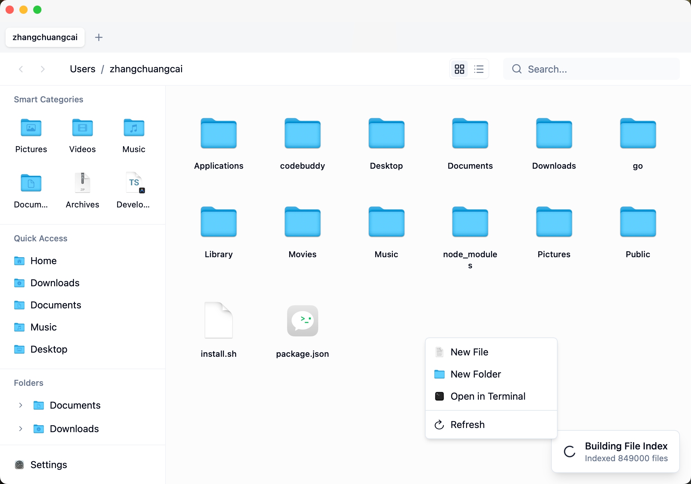
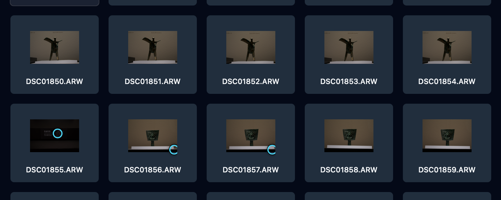
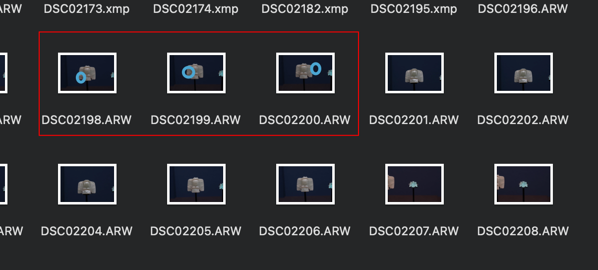
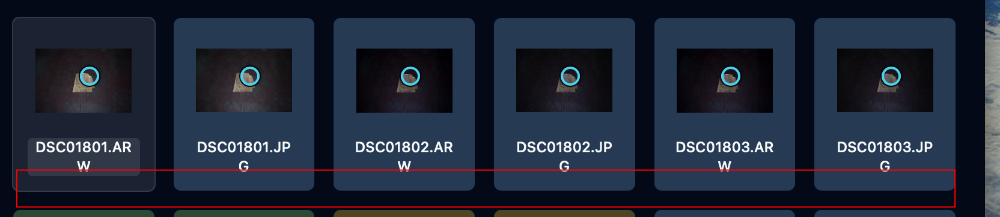
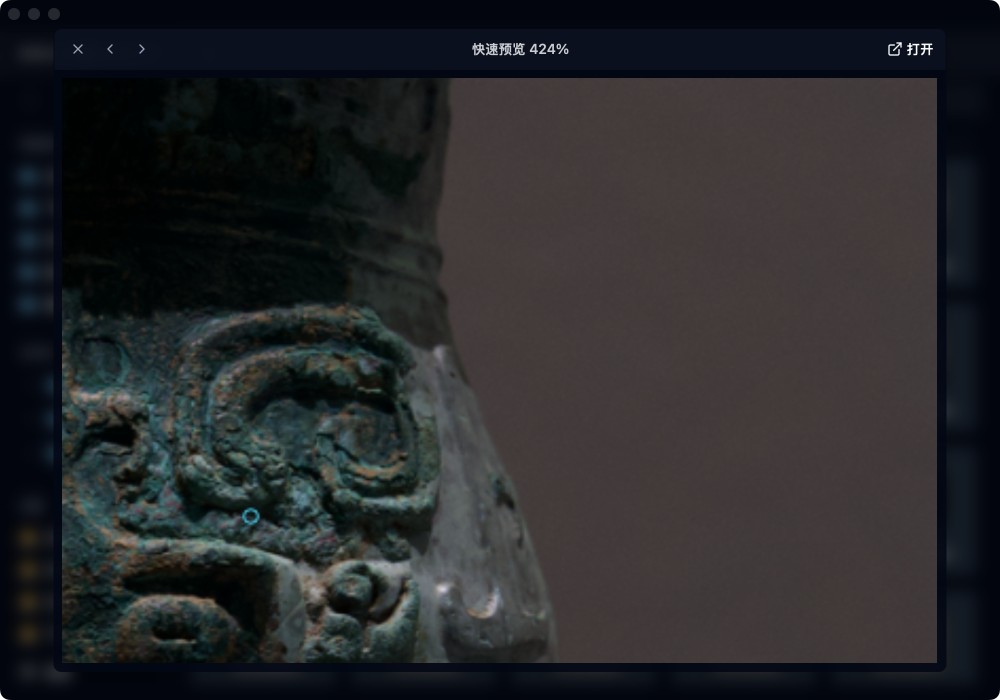

# ImageExplorer

一款现代化、高性能的 macOS 文件管理器 — 基于 Rust 和 React 构建。

[English](./README.md) | [中文](./README.zh-CN.md)

ImageExplorer 将 Windows 资源管理器的高效逻辑带到 macOS：可编辑地址栏、常驻文件夹树、Everything 级极速搜索，同时保持原生 macOS 设计风格。

它也针对实际的摄影筛选流程设计：打开相机照片文件夹，在图标视图中比较一组组相似画面，识别重复视角，查看估算的焦点区域，再把合适的 RAW 送到 Camera Raw 或其他编辑器。



## 摄影筛选工作流

可选的 **视角与焦点识别** 模式会把图标视图变成适合筛 RAW 的 contact sheet。该模式默认关闭，只有从图标视图工具栏主动打开后才会进行识别，因此普通文件夹浏览仍保持轻量、接近 Finder 的体验。



打开后，应用会：

1. 使用低分辨率视觉指纹比较相似画面，并按视角分组；分组不要求文件名连续。
2. 为每组循环分配不同的背景色，方便快速扫过连拍和重复构图。
3. 在缩略图上绘制小型焦点方框；空格预览放大时方框会跟随图片缩放，底部会显示位置、置信度和判断方式。
4. 在文件名下方懒加载 macOS 可读取的 EXIF 摘要，包括尺寸、ISO、光圈、快门、焦段、机身和镜头。

### 相机真实 AF 元数据

如果 Sony RAW/JPEG 中保留了 MakerNote 对焦坐标，ImageExplorer 会调用
ExifTool 读取 `FocusLocation`/`FocusFrameSize`，并兼容文档化的
`FlexibleSpotPosition`。这类结果使用实线青色方框，并标注为“相机 AF”。
虚线琥珀色方框表示文件没有可绘制的相机 AF 坐标，此时才会显示独立的
锐度估算，绝不会冒充相机真实 AF。
部分 Sony 文件只记录 AF 区域的中心点，没有写入区域宽高；这时青色框会标明
“显示框为近似”，框内小点才是文件记录的中心位置。只有同时读取到
`FocusLocation` 和 `FocusFrameSize` 时，才会把方框视为相机记录的精确 AF 区域。

macOS 可通过 `brew install exiftool` 安装 ExifTool，也可以用
`IMAGEEXPLORER_EXIFTOOL` 或 `EXIFTOOL_PATH` 指向应用内或独立的可执行文件。
如果某张 Sony 文件没有写入 AF 坐标，界面会明确显示“相机未记录可绘制 AF
坐标”。标签定义可参考 [ExifTool Sony MakerNote 文档](https://exiftool.org/TagNames/Sony.html)。





选中文件后按 **空格** 打开快速预览，可使用左右箭头按钮或 Left/Right 键切换文件，按住 **⌘/Ctrl + 滚轮** 以鼠标指针为中心放大。相邻 RAW 会提前生成预览，连续浏览时减少等待。



> 只有文件中确实存在 Sony MakerNote 坐标时才绘制“相机 AF”实线方框。没有坐标时的虚线方框只是挑片辅助，最终仍建议结合全尺寸 RAW 判断。

## 功能特性

- **可编辑地址栏** — 输入路径导航、使用 Cmd+C/Cmd+V 复制粘贴、面包屑点击跳转
- **文件夹树状图** — Windows 风格可折叠树，懒加载
- **外接磁盘识别** — 在侧边栏“位置”中显示 macOS 当前挂载的 USB、移动硬盘和网络卷，插拔后自动刷新；首次访问未授权磁盘时会调用 macOS 系统面板请求目录权限
- **可调宽侧边栏** — 拖拽分隔条调整宽度，继续拖到边缘可隐藏；隐藏后显示附着小把手，点击或向右轻拖即可恢复，并自动记住设置
- **极速搜索** — SQLite FTS5 + Rust 驱动的毫秒级全盘搜索，结果面板固定在搜索框下方且不会被文件内容遮挡；搜索结果支持 Finder 风格选中、右键操作和就地重命名
- **Finder 风格缩略图** — 图标 / 列表视图支持常见相机 RAW 格式的原生缩略图，使用进程内 Quick Look 生成，并带有渐进式加载与缓存，适合大目录浏览
- **可选照片分析** — 全局识别相似视角、循环分配组颜色，并在缩略图上标出估算焦点；默认关闭，不影响普通文件夹浏览
- **焦点感知的空格预览** — 使用 Core Image 原始 RAW 解码并渐进加载，支持键盘切换、相邻图片预取、指针中心缩放，以及图片下方的焦点判断数据
- **EXIF 快速查看** — 只对可见图标卡片懒加载，并限制并发数量，在不拖慢网格布局的情况下显示相机参数
- **Finder 风格选择与重命名** — 使用更接近 Finder 的轻量选中态；在图标 / 列表视图中单击已选中的文件名即可就地重命名，Enter 确认、Escape 取消
- **多标签页 & 多窗口** — 标签页支持跨窗口拖拽并保留导航历史；脱离成新窗口后仍打开当前目录并保留历史；文件和文件夹也可拖入另一个窗口或其当前目录，移动完成后源窗口与目标窗口自动刷新
- **Cmd+X 剪切** — 原生剪切支持，告别 Cmd+C → Cmd+Option+V
- **文件操作队列** — 复制、移动、移到废纸篓统一进入顺序任务队列，支持取消、进度、错误、历史记录和常驻操作中心
- **一步撤销** — 已完成的复制/移动会保留可逆历史，可在操作中心撤销；删除操作继续通过系统废纸篓恢复
- **同名冲突处理** — 复制或移动前可选择保留两者、替换（原项目移到废纸篓）、跳过冲突或取消
- **废纸篓管理** — 从侧边栏打开系统废纸篓，浏览项目、恢复到原始位置或清空废纸篓
- **ZIP 工作流** — 在右键菜单中将选中的文件/文件夹压缩为 ZIP，或解压 ZIP；归档任务会进入操作中心
- **项目属性检查器** — 通过“显示简介”查看路径、大小、时间、权限、所有者、Package、Alias 和符号链接目标等详细属性
- **收藏夹与最近位置** — 持久化保存常用文件夹，并从侧边栏快速返回最近访问的目录
- **QuickLook 预览** — 按空格键预览文件（文本、图片、视频、音频、PDF、HEIC、DNG、PSD），并对浏览器不支持的格式回退到 macOS 原生缩略图
- **右键菜单** — Windows 风格，支持 Finder 风格的排序与整理，以及 20+ 操作："新建文件"、文件夹"在新标签页打开"、"在终端打开"、"复制路径"等
- **深色模式** — 浅色 / 深色 / 跟随系统
- **国际化** — 英语、简体中文

## 开发路线

当前实现状态按里程碑跟踪：

| 里程碑 | 状态 | 范围 |
| ------ | ---- | ---- |
| M1 | 已完成 | 丰富文件元数据、发现隐藏项目、显示隐藏文件设置 |
| M2 | 已完成 | 复制/移动/删除任务队列、操作进度中心、取消和跨窗口刷新事件 |
| M3 | 已完成 | 同名冲突窗口，支持保留两者、替换到废纸篓、跳过和取消 |
| M4 | 已完成 | 操作历史，以及已完成复制/移动操作的一步撤销 |
| M5 | 已完成 | 废纸篓浏览/恢复/清空，以及进入任务队列的 ZIP 压缩解压流程 |
| M6 | 已完成 | Package、Alias、符号链接识别，跨平台详细属性查看，以及元数据边界测试 |
| M7 | 已完成 | 持久化收藏夹与最近位置，以及文件菜单和侧边栏管理 |

M3 的冲突决策会应用到当前整个任务。默认的“保留两者”会继续使用已有的自动生成不重名路径逻辑。M4 撤销会删除复制出来的结果，或把移动后的项目移回原目录；删除项目仍通过系统废纸篓恢复。

M5 在支持的平台使用系统废纸篓 API，macOS 使用 Finder 自动化完成浏览、恢复和清空；ZIP 在 macOS 使用 `ditto`，其他平台使用 `zip`/`unzip`。

M6 的“显示简介”会在打开时重新读取文件系统元数据，避免搜索索引中的轻量条目覆盖真实属性；Package 使用目录扩展名识别，Alias 支持 `.alias` 文件标记，macOS Finder Alias 会通过 Spotlight 元数据识别并通过 Finder 自动化解析目标，符号链接保留链接本身与目标路径。

M7 将收藏夹和最多 12 条最近位置保存到应用设置中。收藏夹只接收文件夹，保证侧边栏导航路径明确；两个区域都支持点击打开，右键菜单可以移除条目且不会修改文件系统内容。

## 技术栈

| 层级 | 技术 |
| ---- | ---- |
| 桌面框架 | [Tauri 2](https://tauri.app/) |
| 前端 | React 19 + TypeScript 5.8 |
| 后端 | Rust (2021 edition) |
| 样式 | Tailwind CSS 4 + shadcn/ui |
| 搜索引擎 | SQLite FTS5 + 并行文件遍历 |
| 构建工具 | Vite 7 |
| 包管理器 | pnpm |

## 从源码编译

**前置依赖：**

- [Node.js](https://nodejs.org/) (LTS)
- [pnpm](https://pnpm.io/)
- [Rust](https://www.rust-lang.org/tools/install)
- Xcode Command Line Tools (`xcode-select --install`)

```bash
# 克隆仓库
git clone git@github.com:callback-io/ImageExplorer.git
cd ImageExplorer

# 安装依赖
pnpm install

# 开发模式运行
pnpm tauri dev

# 构建生产版本 (.dmg)
pnpm tauri build
```

## 开发

### 常用命令

| 命令 | 说明 |
| ---- | ---- |
| `pnpm tauri dev` | 启动应用（含热更新） |
| `pnpm tauri build` | 构建生产版本 |
| `pnpm dev` | 仅启动前端开发服务器（端口 1420） |
| `pnpm check` | ESLint + TypeScript 检查 |
| `pnpm cargo:clippy` | Rust 代码检查（警告视为错误） |
| `pnpm check:all` | 全部检查（前端 + Rust） |

### 项目结构

```text
src/                    # React 前端
├── components/         # UI 组件（FileList、Sidebar、TabBar、TopBar 等）
├── hooks/              # 自定义 Hooks（useTabs、useSetting、useTheme、照片元数据）
├── stores/             # Zustand 状态（viewMode、clipboard、照片分析开关）
├── contexts/           # React Context（tabs、theme）
├── lib/                # 工具库（i18n、设置、缩略图、照片分析、元数据）
└── locales/            # 国际化翻译（en、zh）

src-tauri/src/          # Rust 后端
├── commands/           # Tauri 命令（文件系统/EXIF、缩略图、搜索、应用、监听）
├── db/                 # SQLite 层（schema、索引器、搜索引擎）
└── index/              # 内存索引（回退方案）
```

### Git Hooks

通过 [Husky](https://typicode.github.io/husky/) + [lint-staged](https://github.com/lint-staged/lint-staged) 实现提交前自动检查：

- `*.{ts,tsx}` → ESLint 修复 + Prettier 格式化
- `*.{json,css,md}` → Prettier 格式化

## 许可证

[BSL 1.1](./LICENSE) — 非商业用途免费使用。详见 LICENSE 文件。
